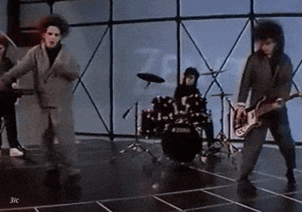

# Laboratorio 1: Presentación Personal

Soy Tomás Abedrapo, actualmente finalizando la carrera de ingeniería civíl eléctrica de la universidad de chile y con miras de realizar el Magister en Data Science (MDS).

## Contacto

Puedes contactarme por correo mediante:

## Intereses

🤔

-Estoy enfocado en todo lo que es inteligencia computacional, machine learning, etc.

-Tengo un interés por llevar a cabo un proyecto relacionado con Natural Lenguage Processing en traducción de lenguage oyente a lengua de señas.

-Me gusta construir circuitos de amplificación analógica.

-Me gusta mucho la música. Mi grupo favorito es The Cure.

